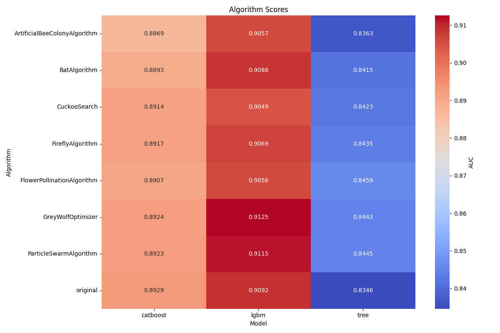

# Fraud Transaction Detection: Nature Inspired Computing

This repository contains the project report, presentation slides, and source code for our research on applying **Nature Inspired Computing (NIC)** algorithms to enhance machine learning models for fraud detection in banking systems.

## Overview

Fraud detection is a critical task in domains like banking, e-commerce, and insurance. Traditional machine learning methods often struggle with imbalanced datasets and require extensive hyperparameter tuning. Our project explores the use of NIC algorithms to optimize feature selection and improve the performance of machine learning models, particularly gradient boosting algorithms.

## Key Contributions

- **Comparison with Gradient Boosting Models**: We evaluate the performance of NIC algorithms when applied to advanced models like CatBoost and LightGBM.
- **Feature Selection with NIC Algorithms**: We analyze the impact of NIC-based feature selection on model performance.
- **Comprehensive Results**: Our experiments reveal insights into the applicability of NIC algorithms for fraud detection tasks.

## Methodology

1. **Dataset**: We used the publicly available [IEEE Fraud Detection Dataset](https://www.kaggle.com/c/ieee-fraud-detection/overview).
2. **Models**:
   - Gradient Boosting Models: CatBoost, LightGBM
   - Baseline: Decision Tree
3. **NIC Algorithms**:
   - Firefly Algorithm
   - Cuckoo Search Algorithm
   - Bat Algorithm
   - Flower Pollination Algorithm
   - Grey Wolf Optimizer
   - Particle Swarm Optimization
4. **Evaluation Metric**: ROC AUC

## Results

The table below summarizes the performance of machine learning models with NIC-based feature selection:

| Method                | CatBoost       | LightGBM       | DecisionTree   |
|-----------------------|----------------|----------------|----------------|
| **Original Score**    | **0.893**      | 0.909          | 0.835          |
| Artificial Bee Colony | 0.887          | 0.906          | 0.836          |
| Cuckoo Search         | 0.891          | 0.905          | 0.842          |
| Bat Algorithm         | 0.889          | 0.909          | 0.842          |
| Firefly Algorithm     | 0.892          | 0.907          | 0.844          |
| Flower Pollination    | 0.891          | 0.906          | **0.846**      |
| Grey Wolf Optimizer   | 0.892          | **0.913**      | 0.844          |
| Particle Swarm        | 0.892          | 0.912          | 0.845          |

### Visual Representation



## Conclusion

- NIC algorithms improve the performance of simple models like Decision Tree but do not consistently enhance gradient boosting models.
- Gradient boosting models are less prone to overfitting on large feature sets, reducing the effectiveness of NIC-based feature selection.

## Repository Structure

```
project/
├── README.md               # Project documentation
├── reference-work/         # Original research (Decision Tree) repo
├── propopsal/              # LaTeX source for the project proposal
├── project-report/         # LaTeX source for the project report
├── slides/                 # LaTeX source for presentation slides
├── assets/                 # Images and other assets
└── notebooks/              # Source code for experiments
```

## References

1. [GitHub: Transactions Fraud Detection](https://github.com/pmacinec/transactions-fraud-detection)
2. [IEEE Fraud Detection Dataset](https://www.kaggle.com/c/ieee-fraud-detection/overview)
3. [CatBoost: Unbiased Boosting with Categorical Features](https://arxiv.org/abs/1706.09516)
4. [LightGBM: A Highly Efficient Gradient Boosting Decision Tree](https://proceedings.neurips.cc/paper_files/paper/2017/file/6449f44a102fde848669bdd9eb6b76fa-Paper.pdf)
5. [NiaPy: Nature-Inspired Algorithms](https://github.com/NiaOrg/NiaPy)

## Authors

- Nikita Zagainov
- Dmitry Tetkin
- Alisher Kamolov
- Nikita Tsukanov

## License

This project is open-source and available under the [MIT License](LICENSE).
